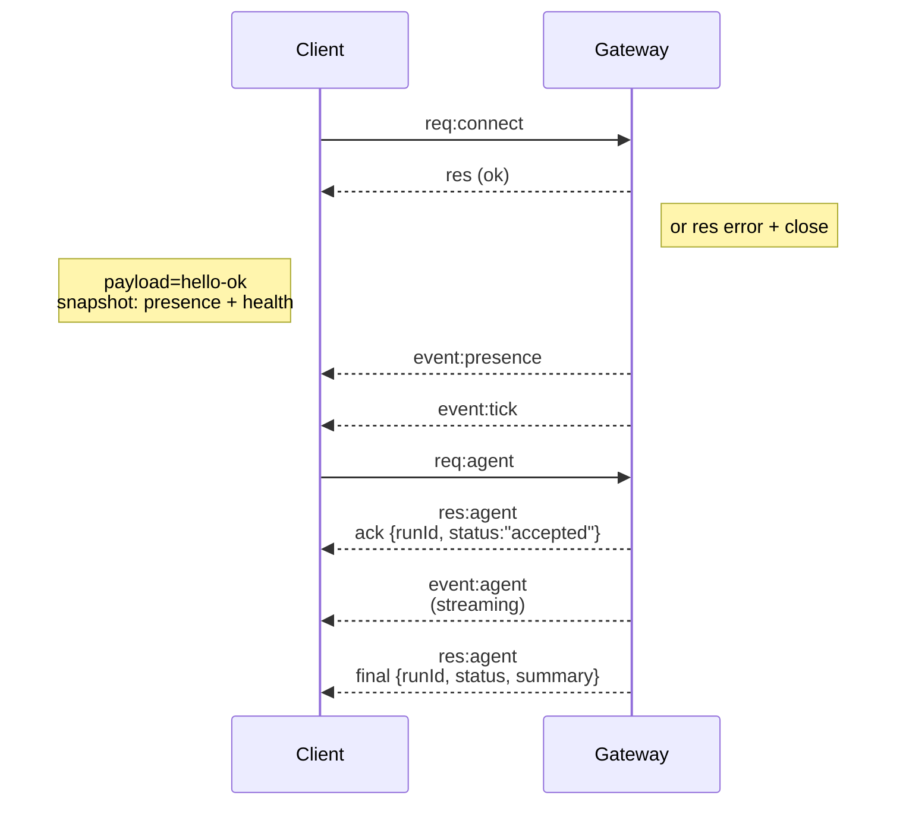

# 网关架构

# 网关架构

最后更新：2026-01-22

## 概述

* 一个单一的长期运行的**网关**拥有所有消息渠道（WhatsApp 通过 Baileys、Telegram 通过 grammY、Slack、Discord、Signal、iMessage、WebChat）。
* 控制平面客户端（macOS 应用、CLI、网页 UI、自动化）通过 **WebSocket** 连接到网关，连接到配置的绑定主机（默认 `127.0.0.1:18789`）。
* **节点**（macOS/iOS/Android/无头）也通过 **WebSocket** 连接，但声明 `role: node` 并带有明确的 caps/命令。
* 每个主机一个网关；它是唯一打开 WhatsApp 会话的地方。
* **canvas 主机**由网关 HTTP 服务器提供服务：
  * `/__openclaw__/canvas/`（代理可编辑的 HTML/CSS/JS）
  * `/__openclaw__/a2ui/`（A2UI 主机）
  它使用与网关相同的端口（默认 `18789`）。

## 组件和流程

### 网关（守护进程）

* 维护提供商连接。
* 公开类型化 WS API（请求、响应、服务器推送事件）。
* 验证入站帧是否符合 JSON Schema。
* 发出如 `agent`、`chat`、`presence`、`health`、`heartbeat`、`cron` 等事件。

### 客户端（mac 应用 / CLI / 网页管理）

* 每个客户端一个 WS 连接。
* 发送请求（`health`、`status`、`send`、`agent`、`system-presence`）。
* 订阅事件（`tick`、`agent`、`presence`、`shutdown`）。

### 节点（macOS / iOS / Android / 无头）

* 使用 `role: node` 连接到**相同的 WS 服务器**。
* 在 `connect` 中提供设备身份；配对是**基于设备的**（角色 `node`），批准存在于设备配对存储中。
* 公开如 `canvas.*`、`camera.*`、`screen.record`、`location.get` 等命令。

协议详情：
* [网关协议](/gateway/protocol)

### WebChat

* 使用网关 WS API 进行聊天历史和发送的静态 UI。
* 在远程设置中，通过与其他客户端相同的 SSH/Tailscale 隧道连接。

## 连接生命周期（单个客户端）



## 有线协议（摘要）

* 传输：WebSocket，带 JSON 负载的文本帧。
* 第一帧**必须**是 `connect`。
* 握手后：
  * 请求：`{type:"req", id, method, params}` → `{type:"res", id, ok, payload|error}`
  * 事件：`{type:"event", event, payload, seq?, stateVersion?}`
* 如果设置了 `OPENCLAW_GATEWAY_TOKEN`（或 `--token`），`connect.params.auth.token` 必须匹配，否则套接字关闭。
* 幂等性键对于有副作用的方法（`send`、`agent`）是必需的，以安全重试；服务器保持短期去重缓存。
* 节点必须在 `connect` 中包含 `role: "node"` 加上 caps/commands/permissions。

## 配对 + 本地信任

* 所有 WS 客户端（操作员 + 节点）在 `connect` 上包含**设备身份**。
* 新设备 ID 需要配对批准；网关为后续连接颁发**设备令牌**。
* **本地**连接（回环或网关主机自己的 tailnet 地址）可以自动批准，以保持同主机用户体验流畅。
* 所有连接都必须对 `connect.challenge` nonce 进行签名。
* 签名负载 `v3` 还绑定 `platform` + `deviceFamily`；网关在重新连接时固定配对的元数据，并要求元数据更改时修复配对。
* **非本地**连接仍然需要明确批准。
* 网关认证（`gateway.auth.*`）仍然适用于**所有**连接，无论是本地还是远程。

详情：[网关协议](/gateway/protocol)、[配对](/channels/pairing)、[安全](/gateway/security)。

## 协议类型和代码生成

* TypeBox 模式定义协议。
* 从这些模式生成 JSON Schema。
* 从 JSON Schema 生成 Swift 模型。

## 远程访问

* 首选：Tailscale 或 VPN。

* 替代方案：SSH 隧道

  ```bash
  ssh -N -L 18789:127.0.0.1:18789 user@host
  ```

* 相同的握手 + 认证令牌也适用于隧道。

* 在远程设置中可以为 WS 启用 TLS + 可选固定。

## 操作快照

* 启动：`openclaw gateway`（前台，日志输出到 stdout）。
* 健康：通过 WS 的 `health`（也包含在 `hello-ok` 中）。
* 监督：launchd/systemd 用于自动重启。

## 不变量

* 每个主机正好有一个网关控制单个 Baileys 会话。
* 握手是强制性的；任何非 JSON 或非 connect 的第一帧都是硬关闭。
* 事件不重放；客户端必须在间隙时刷新。