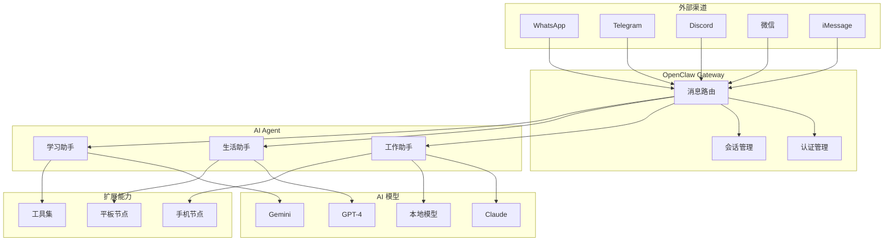

# OpenClaw 是什么？5 分钟理解 AI 网关的核心价值

**教程编号**: 01  
**优先级**: P0  
**预估阅读时间**: 8 分钟  
**目标读者**: 完全新手，想了解 OpenClaw 能做什么

---

## 1.1 什么是 AI 网关？

### 传统 AI 使用的痛点

想象一下你日常使用 AI 助手的场景：

- 早上用 **ChatGPT** 写邮件
- 中午用 **Claude** 分析文档
- 晚上用 **Gemini** 查资料
- 在 **微信** 里问同事问题
- 在 **Telegram** 群里讨论项目
- 在 **Discord** 社区寻求帮助

每个平台都有独立的账号、独立的对话历史、独立的操作界面。你需要：

1. 打开不同的网页或应用
2. 记住多个账号的登录状态
3. 在不同界面之间切换
4. 重复上传相同的文件
5. 无法跨平台追踪对话历史

**这就像你有 5 个不同的手机，每个只能打给特定的人——荒谬但真实。**

### 网关的概念

**网关（Gateway）** 的核心思想很简单：**统一入口，集中管理**。

就像你家里的路由器：
- 所有设备（手机、电脑、电视）都连接到它
- 它负责将流量路由到正确的目的地
- 你只需要管理一个设备，而不是每个设备单独配置

**AI 网关** 做的是同样的事情：
- 所有聊天渠道（WhatsApp、Telegram、Discord、微信）都连接到它
- 它负责将消息路由到正确的 AI 模型
- 你只需要配置一次，所有渠道都能使用

### OpenClaw 的定位

**OpenClaw 是一个本地自托管的 AI 网关**。

关键特性：

| 特性 | 说明 |
|------|------|
| **本地运行** | 安装在你自己的电脑上，数据不经过第三方服务器 |
| **自托管** | 你完全控制配置、数据和隐私 |
| **开源** | 代码公开透明，可审计、可修改 |
| **多合一** | 统一管理多个 AI 提供商和多个聊天渠道 |

**简单说：OpenClaw 让你用自己的电脑，搭建一个私人的 AI 消息处理中心。**

---

## 1.2 OpenClaw 能解决什么问题？

### 问题 1：多渠道统一管理

**场景**：你在 5 个不同的平台有聊天需求。

**传统方式**：
```
WhatsApp → 打开 WhatsApp Web → 输入消息 → 等待回复
Telegram → 打开 Telegram → 输入消息 → 等待回复
Discord  → 打开 Discord → 输入消息 → 等待回复
微信     → 打开微信      → 输入消息 → 等待回复
iMessage → 打开信息      → 输入消息 → 等待回复
```

**使用 OpenClaw**：
```
所有渠道 → OpenClaw Gateway → 统一的 AI 处理 → 返回到原渠道
```

你只需要：
- 配置一次 AI 模型
- 所有渠道自动可用
- 统一的对话历史和管理界面

### 问题 2：多 Agent 协同工作

**场景**：你需要不同的 AI 助手处理不同场景。

**OpenClaw 解决方案**：

```json
{
  "agents": {
    "list": [
      {
        "id": "work",
        "name": "工作助手",
        "model": "anthropic/claude-opus",
        "workspace": "~/.openclaw/workspace-work"
      },
      {
        "id": "personal",
        "name": "生活助手",
        "model": "openai/gpt-4o-mini",
        "workspace": "~/.openclaw/workspace-personal"
      },
      {
        "id": "learning",
        "name": "学习助手",
        "model": "google/gemini-pro",
        "workspace": "~/.openclaw/workspace-learning"
      }
    ]
  }
}
```

**实际效果**：
- 工作群的消息 → 工作助手（专业、严谨）
- 私人聊天 → 生活助手（轻松、幽默）
- 学习讨论 → 学习助手（详细、耐心）
- **会话完全隔离**，互不干扰

### 问题 3：数据本地化

**担心隐私？**

使用在线 AI 服务时：
- 你的对话存储在第三方服务器
- 可能被用于模型训练
- 存在数据泄露风险
- 受限于服务提供商的政策

**使用 OpenClaw**：
- 所有数据存储在本地（`~/.openclaw/`）
- 只有你能够访问
- 可以完全离线运行（使用本地模型）
- 符合企业合规要求

**配置示例**：
```json
{
  "session": {
    "storage": "local",
    "encrypt": true,
    "backup": {
      "enabled": true,
      "path": "~/Backups/OpenClaw/"
    }
  }
}
```

### 问题 4：自动化工作流

**场景**：你想让 AI 自动处理重复性任务。

**OpenClaw 能力**：

1. **定时任务**
   ```bash
   # 每天早上 8 点发送天气提醒
   openclaw cron add "0 8 * * *" "weather beijing"
   ```

2. **消息路由**
   ```json
   {
     "routing": {
       "rules": [
         {
           "if": { "contains": "订单" },
           "route_to": "work"
         },
         {
           "if": { "contains": "食谱" },
           "route_to": "personal"
         }
       ]
     }
   }
   ```

3. **工具调用**
   - 自动搜索网络信息
   - 读取/写入文件
   - 执行 shell 命令
   - 调用外部 API

---

## 1.3 核心架构解析

### 架构图



### 核心组件详解

#### 1. Gateway（网关）

**职责**：消息中转站

- 接收来自各渠道的消息
- 执行认证和授权检查
- 路由到正确的 Agent
- 将响应返回到原渠道

**配置示例**：
```json
{
  "gateway": {
    "port": 18789,
    "bind": "127.0.0.1",
    "auth": {
      "mode": "token",
      "token": "your-secret-token"
    }
  }
}
```

**关键参数**：
- `port`: 监听端口（默认 18789）
- `bind`: 绑定地址（`127.0.0.1` 仅本地，`0.0.0.0` 允许远程）
- `auth.mode`: 认证模式（token/password/none）

#### 2. Agent（智能体）

**职责**：实际处理逻辑

- 维护独立的会话历史
- 配置特定的 AI 模型
- 定义工具使用策略
- 管理专属工作空间

**配置示例**：
```json
{
  "agents": {
    "defaults": {
      "workspace": "~/.openclaw/workspace",
      "model": {
        "primary": "anthropic/claude-sonnet-4-5",
        "fallbacks": ["openai/gpt-5.2"]
      }
    },
    "list": [
      {
        "id": "work",
        "workspace": "~/.openclaw/workspace-work",
        "model": {
          "primary": "anthropic/claude-opus"
        }
      }
    ]
  }
}
```

#### 3. Channel（渠道）

**职责**：连接外部平台

支持的渠道：
- **即时通讯**：WhatsApp、Telegram、Discord、Slack
- **苹果生态**：iMessage、FaceTime
- **社交网络**：微信（通过插件）、Facebook Messenger
- **自定义**：Webhook、API 接口

**配置示例**：
```json
{
  "channels": {
    "telegram": {
      "enabled": true,
      "botToken": "123:abc-xyz",
      "dmPolicy": "pairing"
    },
    "whatsapp": {
      "enabled": true,
      "dmPolicy": "allowlist",
      "allowFrom": ["+86-138-0000-0000"]
    }
  }
}
```

**dmPolicy 说明**：
- `pairing`: 需要配对码批准（推荐）
- `allowlist`: 仅允许指定用户
- `open`: 开放访问（不推荐）
- `disabled`: 禁用私信

#### 4. Node（节点）

**职责**：扩展设备能力

- 连接手机、平板等移动设备
- 远程执行命令
- 获取设备信息（相机、位置、通知）
- 屏幕共享和控制

**使用场景**：
```bash
# 查看已连接节点
openclaw nodes status

# 获取手机位置
openclaw nodes invoke --node my-phone location_get

# 拍摄照片
openclaw nodes invoke --node my-phone camera_snap --facing back

# 在手机上执行命令
openclaw nodes invoke --node my-phone run --command "ls -la"
```

#### 5. Tools（工具集）

**职责**：扩展 AI 能力

内置工具：
- `read` / `write` / `edit`: 文件操作
- `exec`: 执行 shell 命令
- `web_search`: 网络搜索
- `web_fetch`: 抓取网页内容
- `browser`: 浏览器自动化
- `image`: 图像分析
- `pdf`: PDF 文档分析
- `tts`: 语音合成

**安全策略**：
```json
{
  "tools": {
    "exec": {
      "security": "allowlist",
      "allowlist": [
        "ls",
        "cat",
        "grep",
        "git status",
        "npm test"
      ]
    }
  }
}
```

---

## 1.4 适用场景

### 场景 1：个人用户 - 统一 AI 助手

**需求**：
- 在所有聊天平台使用同一个 AI 助手
- 保持对话历史连续性
- 保护隐私数据

**配置方案**：
```json
{
  "agents": {
    "defaults": {
      "workspace": "~/.openclaw/workspace",
      "model": {
        "primary": "anthropic/claude-sonnet-4-5"
      }
    }
  },
  "channels": {
    "telegram": { "enabled": true, "dmPolicy": "pairing" },
    "whatsapp": { "enabled": true, "dmPolicy": "pairing" },
    "discord": { "enabled": true, "dmPolicy": "pairing" }
  },
  "session": {
    "dmScope": "per-channel-peer"
  }
}
```

**效果**：
- 在 Telegram 开始对话
- 在 WhatsApp 继续同一话题
- AI 记住所有历史
- 数据完全本地存储

### 场景 2：小团队 - 客服自动化

**需求**：
- 多个客服共享 AI 助手
- 自动回答常见问题
- 复杂问题转人工

**配置方案**：
```json
{
  "agents": {
    "list": [
      {
        "id": "support-1",
        "name": "客服 1 号",
        "workspace": "~/.openclaw/workspace-support-1"
      },
      {
        "id": "support-2",
        "name": "客服 2 号",
        "workspace": "~/.openclaw/workspace-support-2"
      }
    ]
  },
  "routing": {
    "strategy": "round-robin"
  },
  "tools": {
    "web_search": {
      "enabled": true,
      "provider": "brave"
    }
  }
}
```

**效果**：
- 客户消息自动分配给客服 Agent
- AI 自动回答常见问题
- 复杂问题转接人工
- 所有对话记录可追溯

### 场景 3：开发者 - 本地测试环境

**需求**：
- 快速测试 AI 功能
- 隔离开发和生产数据
- 使用本地模型降低成本

**配置方案**：
```json
{
  "agents": {
    "list": [
      {
        "id": "dev",
        "name": "开发环境",
        "workspace": "~/.openclaw/workspace-dev",
        "model": {
          "primary": "ollama/llama3"
        }
      }
    ]
  },
  "gateway": {
    "port": 18790,
    "bind": "127.0.0.1"
  },
  "tools": {
    "exec": {
      "security": "full"
    }
  }
}
```

**效果**：
- 使用本地 Ollama 模型
- 完全隔离开发数据
- 自由测试各种功能
- 零 API 成本

### 场景 4：企业 - 私有化部署

**需求**：
- 数据不出内网
- 符合安全合规
- 支持多租户

**配置方案**：
```json
{
  "gateway": {
    "bind": "10.0.0.100",
    "auth": {
      "mode": "password",
      "passwordHash": "$2b$12$..."
    },
    "tls": {
      "enabled": true,
      "cert": "/etc/ssl/openclaw.crt",
      "key": "/etc/ssl/openclaw.key"
    }
  },
  "session": {
    "storage": "encrypted",
    "encryptionKey": "env:ENCRYPTION_KEY"
  },
  "audit": {
    "enabled": true,
    "logPath": "/var/log/openclaw/"
  }
}
```

**效果**：
- 所有数据加密存储
- 完整审计日志
- 符合 GDPR/HIPAA 等合规要求
- 支持 SSO 集成

---

## 1.5 与其他方案对比

### vs 直接使用 ChatGPT/Claude

| 维度 | 直接使用 | OpenClaw |
|------|----------|----------|
| **便利性** | 需要打开网页/应用 | 所有渠道自动可用 |
| **一致性** | 每个平台独立对话 | 统一的 AI 体验 |
| **隐私性** | 数据存储在云端 | 数据本地存储 |
| **成本** | 按平台付费 | 统一管理，优化成本 |
| **自动化** | 有限 | 强大的工作流支持 |
| **集成** | 需要 API 开发 | 内置多渠道支持 |

**结论**：如果你只在单一平台使用 AI，直接使用即可。如果需要跨平台统一管理，OpenClaw 更优。

### vs 其他开源网关项目

| 项目 | OpenClaw | BotPress | Rasa | LangChain |
|------|----------|----------|------|-----------|
| **定位** | AI 网关 | 客服机器人 | 对话框架 | 开发库 |
| **部署** | 本地/自托管 | 云端/本地 | 本地 | 开发库 |
| **渠道** | 10+ 内置 | 需插件 | 需集成 | 需开发 |
| **AI 模型** | 多提供商 | 有限 | 有限 | 灵活 |
| **学习曲线** | 低 | 中 | 高 | 高 |
| **适用场景** | 个人/小团队 | 企业客服 | 定制对话 | 开发者 |

**OpenClaw 优势**：
- 开箱即用，配置简单
- 内置多渠道支持
- 支持所有主流 AI 模型
- 本地运行，隐私保护
- 活跃的社区和生态

**OpenClaw 劣势**：
- 企业级功能相对较少
- 自定义开发需要一定技术能力
- 文档以英文为主（本教程旨在改善）

### 何时选择 OpenClaw？

**选择 OpenClaw，如果**：
- ✅ 需要在多个聊天平台使用 AI
- ✅ 关心数据隐私和本地存储
- ✅ 想要统一管理多个 AI 模型
- ✅ 需要自动化工作流
- ✅ 希望快速部署，无需复杂开发

**不选择 OpenClaw，如果**：
- ❌ 只在一个平台使用 AI
- ❌ 需要完全托管的云服务
- ❌ 需要复杂的企业级功能（多租户、计费等）
- ❌ 完全不懂技术，不愿学习配置

---

## 小结

### 核心要点

1. **OpenClaw 是什么**：本地自托管的 AI 网关
2. **解决什么问题**：多渠道统一管理、多 Agent 协同、数据本地化、自动化工作流
3. **核心架构**：Gateway（网关）+ Agent（智能体）+ Channel（渠道）+ Node（节点）
4. **适用场景**：个人用户、小团队、开发者、企业
5. **核心优势**：开箱即用、多渠道支持、隐私保护、成本优化

### 下一步

理解了 OpenClaw 的价值后，下一步是实际安装和部署：

**阅读下一篇**：[教程 02: 环境准备和安装 - 从零开始部署 OpenClaw](./02-installation.md)

---

## 配图建议

### 图 1：传统 AI 使用 vs OpenClaw 对比

**内容**：
- 左侧：5 个独立的图标（WhatsApp、Telegram、Discord、微信、iMessage），每个都连接到不同的 AI 服务
- 右侧：所有渠道连接到 OpenClaw Gateway，再统一连接到 AI 模型
- 用箭头和文字标注"混乱"vs"统一"

**用途**：教程开头，直观展示价值

### 图 2：OpenClaw 架构图

**内容**：
- 使用本文的 Mermaid 图表
- 或制作更美观的可视化版本
- 标注各组件的职责

**用途**：1.3 节，解释核心架构

### 图 3：使用场景对比

**内容**：
- 4 个场景的图标 + 简短说明
- 个人用户：手机 + 多个聊天应用图标
- 小团队：多人 + 客服对话框
- 开发者：代码编辑器 + 终端
- 企业：服务器机房 + 安全锁

**用途**：1.4 节，展示适用场景

### 图 4：功能特性清单

**内容**：
- 检查列表形式
- ✅ 多渠道统一管理
- ✅ 多 Agent 协同
- ✅ 数据本地存储
- ✅ 自动化工作流
- ✅ 支持主流 AI 模型
- ✅ 开源可审计

**用途**：文章结尾，强化记忆点

---

## 代码示例汇总

### 1. 快速安装
```bash
# macOS/Linux
curl -fsSL https://openclaw.ai/install.sh | bash

# Windows PowerShell
iwr -useb https://openclaw.ai/install.ps1 | iex
```

### 2. 运行向导
```bash
openclaw onboard --install-daemon
```

### 3. 检查状态
```bash
openclaw gateway status
```

### 4. 打开控制面板
```bash
openclaw dashboard
```

### 5. 多 Agent 配置
```json
{
  "agents": {
    "list": [
      {
        "id": "work",
        "workspace": "~/.openclaw/workspace-work",
        "model": { "primary": "anthropic/claude-opus" }
      },
      {
        "id": "personal",
        "workspace": "~/.openclaw/workspace-personal",
        "model": { "primary": "openai/gpt-4o-mini" }
      }
    ]
  }
}
```

### 6. 渠道配置
```json
{
  "channels": {
    "telegram": {
      "enabled": true,
      "botToken": "YOUR_BOT_TOKEN",
      "dmPolicy": "pairing"
    }
  }
}
```

---

**字数统计**: 约 4,200 字  
**完成时间**: 2026-03-14  
**作者**: OpenClaw 文档团队  
**审阅状态**: 初稿


---

## 📚 相关内容

- [快速开始](/tutorials/01-quick-start)
- [安装指南](/tutorials/02-installation)
- [配置教程](/tutorials/03-configuration)
- [核心概念](/tutorials/103-core-concepts)
- [频道配置](/channels/)
